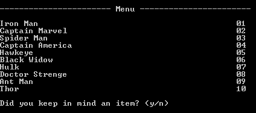
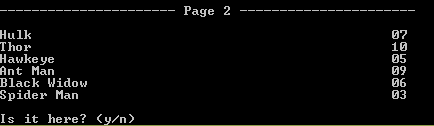
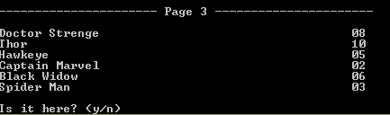
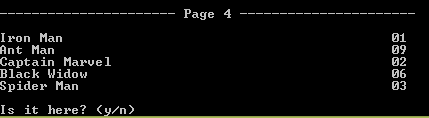

# Magic Book

This is the 'Magic Book' application with CLI. With this application you can tell what others thinking. It can do with few number of simple steps. In the begginning you shold let your friend to keep in mind an item from the menu. Then you should ask them is it in page 1, page 2, page 3 and, page 4. After enter the y or n (yes or no) for above pages, you can see which item kept in mind in your friend.

## Screenshots of the Application

#### Menu

#### Page 1

#### Page 2

#### Page 3

#### Page 4

